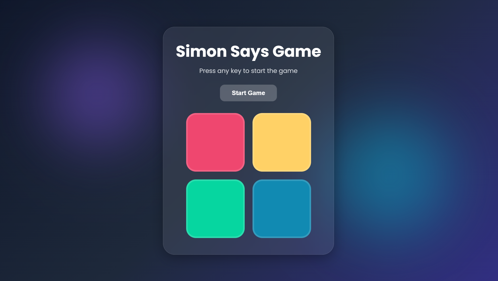

# 🎮 Simon Says Game

A modern and responsive **Simon Says Memory Game** built using **HTML, CSS, and JavaScript**. Test your memory by following the sequence of colors and sounds as the game becomes progressively more challenging with each level.

## 🌐 Live Demo

Click here for live demo:

```text
https://simon-says-game-seven-fawn.vercel.app/
```

---

## 📸 Preview



---

## ✨ Features

* 🎯 Classic Simon Says gameplay
* 🎨 Modern Glassmorphism UI
* 📱 Fully Responsive Design (Desktop, Tablet & Mobile)
* 🔊 Sound Effects for Each Colored Button
* 📈 Progressive Difficulty Levels
* 🏆 High Score Tracking using Local Storage
* ✨ Interactive Animations and Visual Feedback
* 🚀 Mobile-Friendly Start Button
* 💾 Persistent High Score across sessions

---

## 🛠️ Technologies Used

* **HTML5** – Structure of the application
* **CSS3** – Styling, animations, responsiveness, and Glassmorphism effects
* **JavaScript (ES6)** – Game logic, event handling, score management, and sound integration
* **Local Storage API** – Persistent high score tracking

---

## 🎮 How to Play

1. Click the **Start Game** button.
2. Watch the sequence of flashing colors.
3. Repeat the sequence by clicking the colored buttons in the same order.
4. Every correct round increases the level and extends the sequence.
5. The game ends when an incorrect button is clicked.
6. Try to beat your highest score!

---

## 📂 Project Structure

```text
Simon-Says-Game/
│
├── index.html
├── style.css
├── app.js
│
├── assets/
│   ├── blue.mp3
│   ├── red.mp3
│   ├── yellow.mp3
│   ├── green.mp3
│   ├── level-up.mp3
│   ├── game-over.mp3
│   └── ss.png
│
└── README.md
```

---

## 🔊 Sound Effects

The game includes:

* Unique sound for each colored button
* Level-up sound effect
* Game-over sound effect

These audio cues enhance gameplay and provide a more immersive experience.

---

## 🏆 High Score System

The game automatically stores the highest score using the browser's Local Storage.

* High score persists even after refreshing the page.
* Updates automatically whenever a new record is achieved.

---

## 📱 Responsive Design

The game has been optimized for:

* 💻 Desktop Screens
* 🖥️ Laptop Screens
* 📱 Mobile Devices
* 📟 Tablets

The layout adapts smoothly across different screen sizes to ensure a consistent user experience.

---

## 🚀 Future Improvements

* Dark/Light Theme Toggle
* Difficulty Modes
* Multiplayer Mode
* Leaderboard System
* Progressive Sound Themes
* PWA (Installable Web App)

---

## 👨‍💻 Author

**Vriddhi Mishra**

Built while learning JavaScript, DOM Manipulation, Event Handling, Responsive Web Design, and Local Storage.

---

⭐ If you like this project, consider giving it a star!
